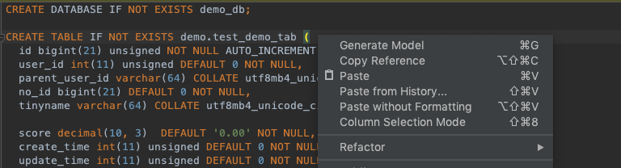
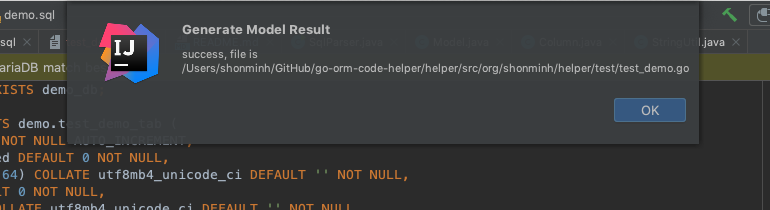
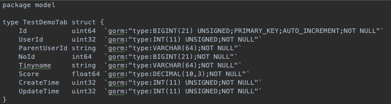

# go-orm-code-helper

## Description

ORM code helper for go language, it can generate model struct by creating sql statement.

## Usage

1. right click and select `Generate Model` or just print `⌘ + G` 

2. get result tip:

3. get result go model file: 

## License

MIT License